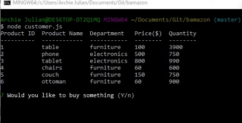
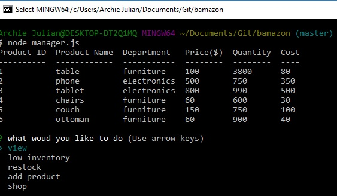
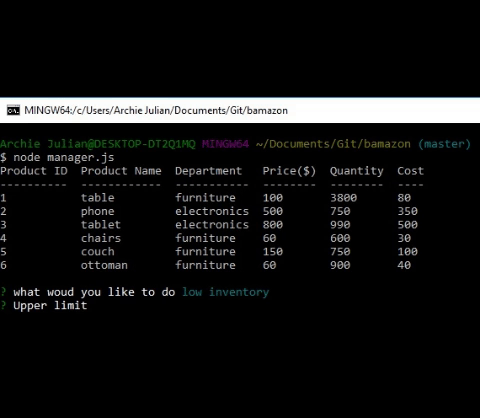
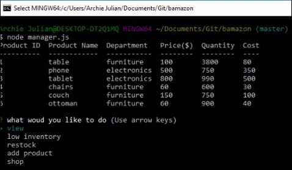
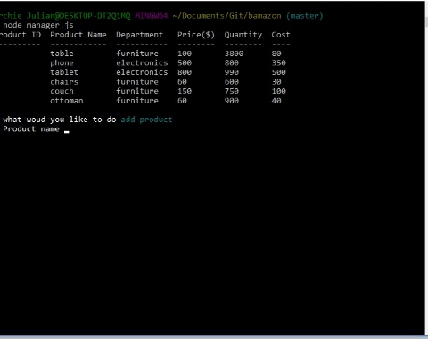
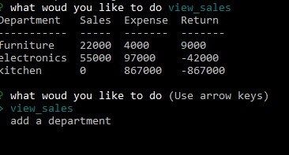
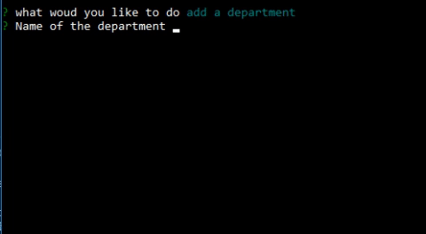

# bamazon

A command line base program that simulate an amazon-espue storefront with three authorization levels

# Install

You will need the following node packages to run the program

+ File-System  
+ mysql
+ easy-table
+ inquirer


# Usage

As mentioned there are three levels of authorization 

## Customer Level

  ``` javascript 
node customer.js
 ```

In this level the only choice the user gets is to view the products and the prompt if they would like to buy something



## Manager Level

  ``` javascript 
node manager.js
 ```

For this level the user has the following options

### View
For this option the user sees the same table as the customer. The only addage is that they would also see the cost of the products



### Filtered View
This option prompts the user to enter an upper limit and the code will return products with quantity below that



### Restock
This option allows the user to restock specific product



### Add new Product
This option will enter a new prodcut into the table



## Supervisor Level

### View Sales

  ``` javascript 
node supervisor.js
 ```

This option shows the total revenue per department



### Add department

This option prompts the user for the name of the new department,which will update the department.txt




